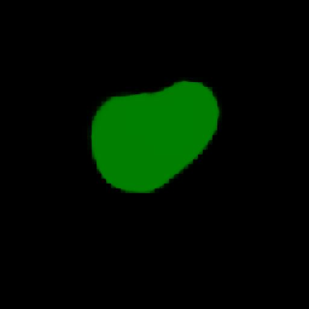
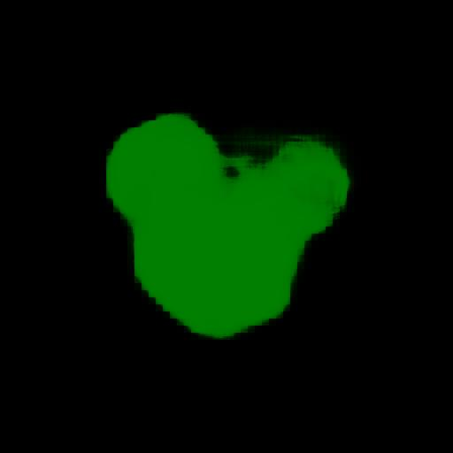
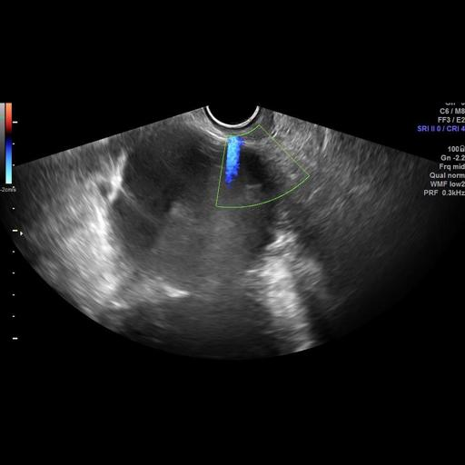

<h2>Tensorflow-Image-Segmentation-Ovarian-Tumor (Updted: 2024/10/19)</h2>
<li>2024/10/18: Retrained Ovarian-Tumor model by using the latest 
<a href="https://github.com/sarah-antillia/Tensorflow-Image-Segmentation-API">Tensorflow-Image-Segmentation-API</a>,
.</li>
 

This is an experimental Image Segmentation project for Ovarian-Tumor based on
the <a href="https://github.com/sarah-antillia/Tensorflow-Image-Segmentation-API">Tensorflow-Image-Segmentation-API</a>,
and <a href="https://drive.google.com/file/d/1LU7bOmxcZfEBqv3s1RGxYwMNtE4rLPeA/view?usp=sharing">
Ovarian-Tumor-ImageMask-1Class-Dataset.zip.</a>, which was derived by us from 
<a href="https://drive.google.com/drive/folders/1c5n0fVKrM9-SZE1kacTXPt1pt844iAs1?usp=sharing">
MMOTU.</a> 
 

<b>Actual Image Segmentation for Images of 512x512 pixels</b> 
As shown below, the inferred masks look similar to the ground truth masks.  

<table>
<tr>
<th>Input: image</th>
<th>Mask (ground_truth)</th>
<th>Prediction: inferred_mask</th>
</tr>
<tr>
<td></td>
<td></td>
<td></td>
</tr>

<tr>
<td></td>
<td></td>
<td></td>
</tr>

<tr>
<td></td>
<td></td>
<td></td>
</tr>

</table>

 
In this experiment, we used the simple UNet Model 
<a href="./src/TensorflowUNet.py">TensorflowSlightlyFlexibleUNet</a> for this Alzheimer-s-Disease Segmentation Model. 
As shown in <a href="https://github.com/sarah-antillia/Tensorflow-Image-Segmentation-API">Tensorflow-Image-Segmentation-API</a>.
you may try other Tensorflow UNet Models: 

<li><a href="./src/TensorflowSwinUNet.py">TensorflowSwinUNet.py</a></li>
<li><a href="./src/TensorflowMultiResUNet.py">TensorflowMultiResUNet.py</a></li>
<li><a href="./src/TensorflowAttentionUNet.py">TensorflowAttentionUNet.py</a></li>
<li><a href="./src/TensorflowEfficientUNet.py">TensorflowEfficientUNet.py</a></li>
<li><a href="./src/TensorflowUNet3Plus.py">TensorflowUNet3Plus.py</a></li>
<li><a href="./src/TensorflowDeepLabV3Plus.py">TensorflowDeepLabV3Plus.py</a></li>

 

Please see also the previous experiment <a href="https://github.com/sarah-antillia/Image-Segmentation-Ovarian-Tumor">
Image-Segmentation-Ovarian-Tumor"</a>
 

<h3>1. Dataset Citatioin</h3>

The original image dataset OTU_2d used here has been taken from the following google drive.
<a href="https://drive.google.com/drive/folders/1c5n0fVKrM9-SZE1kacTXPt1pt844iAs1?usp=sharing">
MMOTU</a> 

Please see also:<a href="https://github.com/cv516Buaa/MMOTU_DS2Net">MMOTU_DS2Net</a> 

<pre>
Dataset
Multi-Modality Ovarian Tumor Ultrasound (MMOTU) image dataset consists of two sub-sets with two modalities, 
which are OTU_2d and OTU_CEUS respectively including 1469 2d ultrasound images and 170 CEUS images. 
On both of these two sub-sets, we provide pixel-wise semantic annotations and global-wise category annotations. 
Many thanks to Department of Gynecology and Obstetrics, Beijing Shijitan Hospital, 
Capital Medical University and their excellent works on collecting and annotating the data.

MMOTU : google drive (move OTU_2d and OTU_3d to data folder. Here, OTU_3d folder indicates OTU_CEUS in paper.)
</pre>

<h3>
<a id="2">
2 Ovarian-Tumor ImageMask Dataset
</a>
</h3>
 If you would like to train this Ovarian-Tumor Segmentation model by yourself,
 please download the  
 augmented dataset of image-size 512x512 from the google drive 
<a href="https://drive.google.com/file/d/1LU7bOmxcZfEBqv3s1RGxYwMNtE4rLPeA/view?usp=sharing">
Ovarian-Tumor-ImageMask-1Class-Dataset.zip.</a>

Please see also the <a href="https://github.com/atlan-antillia/Ovarian-Tumor-1Class-Image-Dataset">Ovarian-Tumor-1Class-Image-Dataset</a>. 
Please expand the downloaded ImageMaskDataset and place them under <b>./dataset</b> folder to be

<pre>
./dataset
└─Ovarian-Tumor
    ├─test
    │  ├─images
    │  └─masks
    ├─train
    │  ├─images
    │  └─masks
    └─valid
        ├─images
        └─masks
</pre>
 
Please run the following bat file to count the number of images in this dataset 
<pre>
dataset_stat.bat
</pre> 
, which generates the following <b>Ovarian-Tumor_Statistics.png</b> file. 
<b>Ovarian-Tumor_Statistics</b> 
 
As shown above, the number of images of train and valid datasets is enough to use for a training set for our segmentation model,
  
<b>Train_images_sample</b> 

 
<b>Train_masks_sample</b> 

 
<h3>
<a id="3">
3 TensorflowSlightlyFlexibleUNet
</a>
</h3>
This <a href="./src/TensorflowUNet.py">TensorflowUNet</a> model is slightly flexibly customizable by a configuration file. 
For example, <b>TensorflowSlightlyFlexibleUNet/Ovarian-Tumor</b> model can be customizable
by using <a href="./projects/TensorflowSlightlyFlexibleUNet/Ovarian-Tumor/train_eval_infer.config">
train_eval_infer.config.</a>

<h3>
3.1 Training
</h3>
Please move to a <b>./projects/TensorflowSlightlyFlexibleUNet/Ovarian-Tumor</b> folder, 
and run the following bat file to train TensorflowUNet model for Ovarian-Tumor. 
<pre>
./1.train.bat
</pre>
<pre>
python ../../../src/TensorflowUNetTrainer.py ./train_eval_infer.config
</pre>

<b>Model parameters</b> 
Defined a small <b>base_filters</b> and large <b>base_kernels</b> for the first Conv Layer of Encoder Block of 
<a href="./src/TensorflowUNet.py">TensorflowUNet.py</a> 
and a large num_layers (including a bridge between Encoder and Decoder Blocks).
<pre>
[model]
model          = "TensorflowUNet"
generator      = True
image_width    = 512
image_height   = 512
image_channels = 3
base_filters   = 16
base_kernels   = (9,9)
num_layers     = 8
dilation       = (1,1)
</pre>

<b>Learning rate</b> 
Defined a small learning rate.  
<pre>
[model]
learning_rate  = 0.00008
</pre>

<b>Online augmentation</b> 
Enabled our online augmentation.  
<pre>
[model]
model         = "TensorflowUNet"
generator     = True
</pre>

<b>Loss and metrics functions</b> 
Specified "bce_dice_loss" and "dice_coef". 
<pre>
[model]
loss           = "bce_dice_loss"
metrics        = ["dice_coef"]
</pre>
<b>Learning rate reducer callback</b> 
Enabled learing_rate_reducer callback, and a small reducer_patience.
<pre> 
[train]
learning_rate_reducer = True
reducer_factor     = 0.4
reducer_patience   = 4
</pre>

<b>Early stopping callback</b> 
Enabled early stopping callback with patience parameter.
<pre>
[train]
patience      = 10
</pre>

<b>Epoch change inference callbacks</b> 
Enabled epoch_change_infer and epoch_changeinfer callbacks. 
<pre>
[train]
epoch_change_infer       = True
epoch_change_infer_dir   =  "./epoch_change_infer"
epoch_changeinfer        = False
epoch_changeinfer_dir    = "./epoch_changeinfer"
num_infer_images         = 6
</pre>

By using these callbacks, on every epoch_change, the inference procedures can be called
 for 6 images in <b>mini_test</b> folder. These will help you confirm how the predicted mask changes 
 at each epoch during your training process.    

<b>Epoch_change_inference output</b> 
 
 
 

In this experiment, the training process was stopped at epoch 45 by EarlyStopping Callback.  

Train console output: 
 
 

 
<a href="./projects/TensorflowSlightlyFlexibleUNet/Ovarian-Tumor/eval/train_metrics.csv">train_metrics.csv</a> 
 

 
<a href="./projects/TensorflowSlightlyFlexibleUNet/Ovarian-Tumor/eval/train_losses.csv">train_losses.csv</a> 
 

 
<h3>
3.2 Evaluation
</h3>
Please move to a <b>./projects/TensorflowSlightlyFlexibleUNet/Ovarian-Tumor</b> folder, 
and run the following bat file to evaluate TensorflowUNet model for Ovarian-Tumor. 
<pre>
./2.evaluate.bat
</pre>
<pre>
python ../../../src/TensorflowUNetEvaluator.py ./train_eval_infer.config
</pre>
<b>Evaluation console output:</b> 
 
 
The loss (bce_dice_loss) to this Ovarian-Tumor/test was low, and dice_coef relatively high as shown below.
 
<pre>
loss,0.0975
dice_coef,0.89
</pre>

 

<h2>
3.3 Inference
</h2>
Please move to a <b>./projects/TensorflowSlightlyFlexibleUNet/Ovarian-Tumor</b> folder 
,and run the following bat file to infer segmentation regions for images by the Trained-TensorflowUNet model for Ovarian-Tumor. 
<pre>
./3.infer.bat
</pre>
<pre>
python ../../../src/TensorflowUNetInferencer.py ./train_eval_infer.config
</pre>
mini_test images 
 
mini_test mask (ground_truth) 
 

 
Inferred test masks 
 
 

<b>Enlarged images and masks </b> 

<table>
<tr>
<th>Image</th>
<th>Mask (ground_truth)</th>
<th>Inferred-mask</th>
</tr>

<tr>
<td></td>
<td></td>
<td></td>
</tr>

<tr>
<td></td>
<td></td>
<td></td>
</tr>

<tr>
<td></td>
<td></td>
<td></td>
</tr>
<tr>
<td></td>
<td></td>
<td></td>
</tr>
<tr>
<td></td>
<td></td>
<td></td>
</tr>

</table>

 

<h3>
References
</h3>
<b>1. Ovarian-Tumor Segmentation Method Applying Coordinate Attention Mechanism and Dynamic Convolution Network</b> 
Juan Jiang, Hong Liu 1ORCID,Xin Yu,Jin Zhan, ORCID,Bing Xiong andLidan Kuang 
Appl. Sci. 2023, 13(13), 7921; https://doi.org/10.3390/app13137921 
<pre>
https://www.mdpi.com/2076-3417/13/13/7921
</pre>
