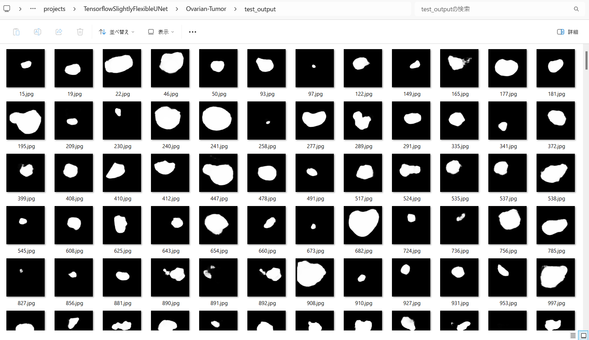

<h2>Tensorflow-Image-Segmentation-Ovarian-Tumor (2024/02/01)</h2>

This is an experimental Image Segmentation project for Ovarian-Tumor based on
the <a href="https://github.com/sarah-antillia/Tensorflow-Image-Segmentation-API">Tensorflow-Image-Segmentation-API</a>.
 
As a first trial, we use the simple UNet Model 
<a href="./src/TensorflowUNet.py">TensorflowSlightlyFlexibleUNet</a> for this Ovarian-Tumor Segmentation. 
As shown in <a href="https://github.com/sarah-antillia/Tensorflow-Image-Segmentation-API">Tensorflow-Image-Segmentation-API</a>.
you may try other Tensorflow UNet Models: 

<li><a href="./src/TensorflowSwinUNet.py">TensorflowSwinUNet.py</a></li>
<li><a href="./src/TensorflowMultiResUNet.py">TensorflowMultiResUNet.py</a></li>
<li><a href="./src/TensorflowAttentionUNet.py">TensorflowAttentionUNet.py</a></li>
<li><a href="./src/TensorflowEfficientUNet.py">TensorflowEfficientUNet.py</a></li>
<li><a href="./src/TensorflowUNet3Plus.py">TensorflowUNet3Plus.py</a></li>
 

Please see also the previous experiment <a href="https://github.com/sarah-antillia/Image-Segmentation-Ovarian-Tumor">
Image-Segmentation-Ovarian-Tumor"</a>
 

<h3>1. Dataset Citatioin</h3>

The original image dataset OTU_2d used here has been taken from the following google drive.
<a href="https://drive.google.com/drive/folders/1c5n0fVKrM9-SZE1kacTXPt1pt844iAs1?usp=sharing">
MMOTU</a> 

Please see also:<a href="https://github.com/cv516Buaa/MMOTU_DS2Net">MMOTU_DS2Net</a> 

<pre>
Dataset
Multi-Modality Ovarian Tumor Ultrasound (MMOTU) image dataset consists of two sub-sets with two modalities, 
which are OTU_2d and OTU_CEUS respectively including 1469 2d ultrasound images and 170 CEUS images. 
On both of these two sub-sets, we provide pixel-wise semantic annotations and global-wise category annotations. 
Many thanks to Department of Gynecology and Obstetrics, Beijing Shijitan Hospital, 
Capital Medical University and their excellent works on collecting and annotating the data.

MMOTU : google drive (move OTU_2d and OTU_3d to data folder. Here, OTU_3d folder indicates OTU_CEUS in paper.)
</pre>

<h3>
<a id="2">
2 Ovarian-Tumor ImageMask Dataset
</a>
</h3>
 If you would like to train this Ovarian-Tumor Segmentation model by yourself,
 please download the  
 augmented dataset of image-size 512x512 from the google drive 
<a href="https://drive.google.com/file/d/1LU7bOmxcZfEBqv3s1RGxYwMNtE4rLPeA/view?usp=sharing">
Ovarian-Tumor-ImageMask-1Class-Dataset.zip.</a>

Please see also the <a href="https://github.com/atlan-antillia/Ovarian-Tumor-1Class-Image-Dataset">Ovarian-Tumor-1Class-Image-Dataset</a>. 
Please expand the downloaded ImageMaskDataset and place them under <b>./dataset</b> folder to be

<pre>
./dataset
└─Ovarian-Tumor
    ├─test
    │  ├─images
    │  └─masks
    ├─train
    │  ├─images
    │  └─masks
    └─valid
        ├─images
        └─masks
</pre>
 
Please run the following bat file to count the number of images in this dataset 
<pre>
dataset_stat.bat
</pre> 
, which generates the following <b>Ovarian-Tumor_Statistics.png</b> file. 
<b>Ovarian-Tumor_Statistics</b> 
 

<h3>
<a id="3">
3 TensorflowSlightlyFlexibleUNet
</a>
</h3>
This <a href="./src/TensorflowUNet.py">TensorflowUNet</a> model is slightly flexibly customizable by a configuration file. 
For example, <b>TensorflowSlightlyFlexibleUNet/Ovarian-Tumor</b> model can be customizable
by using <a href="./projects/TensorflowSlightlyFlexibleUNet/Ovarian-Tumor/train_eval_infer.config">
train_eval_infer.config.</a>
<pre>
; train_eval_infer.config
; 2024/01/31 (C) antillia.com

[model]
model          = "TensorflowUNet"
;base_kernels   = (5,5)
dilation       = (2,2)
image_width    = 512
image_height   = 512
image_channels = 3
num_classes    = 1
base_filters   = 16
num_layers     = 7
dropout_rate   = 0.08
learning_rate  = 0.0001

loss           = "bce_iou_loss"
;loss           = "binary_crossentropy"
metrics        = ["binary_accuracy"]
show_summary   = False

[train]
epochs        = 100
batch_size    = 4
patience      = 10
metrics       = ["binary_accuracy", "val_binary_accuracy"]

model_dir     = "./models"
eval_dir      = "./eval"

image_datapath = "../../../dataset/Ovarian-Tumor/train/images/"
mask_datapath  = "../../../dataset/Ovarian-Tumor/train/masks/"

[eval]
image_datapath = "../../../dataset/Ovarian-Tumor/valid/images/"
mask_datapath  = "../../../dataset/Ovarian-Tumor/valid/masks/"

[infer] 
images_dir    = "../../../dataset/Ovarian-Tumor/test/images/"
output_dir    = "./test_output"
merged_dir    = "./test_output_merged"
green_mask    = True

[mask]
blur      = False
binarize  = True
threshold = 128
</pre>

<h3>
3.1 Training
</h3>
Please move to a <b>./projects/TensorflowSlightlyFlexibleUNet/Ovarian-Tumor</b> folder, 
and run the following bat file to train TensorflowUNet model for Ovarian-Tumor. 
<pre>
./1.train.bat
</pre>
<pre>
python ../../../src/TensorflowUNetTrainer.py ./train_eval_infer.config
</pre>
Train console output: 
 
 

Train metrics: 
 
 
Train losses: 
 
 
<h3>
3.2 Evaluation
</h3>
Please move to a <b>./projects/TensorflowSlightlyFlexibleUNet/Ovarian-Tumor</b> folder, 
and run the following bat file to evaluate TensorflowUNet model for Ovarian-Tumor. 
<pre>
./2.evaluate.bat
</pre>
<pre>
python ../../../src/TensorflowUNetEvaluator.py ./train_eval_infer.config
</pre>
<b>Evaluation console output:</b> 
 
As shown above, the accuracy 0.9789 for test dataset is higher than the accuracy 0.7592 of
the first experiment <a href="https://github.com/sarah-antillia/Image-Segmentation-Ovarian-Tumor">Image-Segmentation-Ovarian-Tumor</a> 
<b>Evaluation result of the first Image-Segmentation-Ovarian-Tumor</b>: 
 

<h2>
3.3 Inference
</h2>
Please move to a <b>./projects/TensorflowSlightlyFlexibleUNet/Ovarian-Tumor</b> folder 
,and run the following bat file to infer segmentation regions for images by the Trained-TensorflowUNet model for Ovarian-Tumor. 
<pre>
./3.infer.bat
</pre>
<pre>
python ../../../src/TensorflowUNetInferencer.py ./train_eval_infer.config
</pre>
Sample test images 
 
Sample test mask 
 

 
Inferred test masks 
 
 
Merged test images and inferred masks  
  

Enlarged samples 
<table>
<tr>
<td>
test/images/15.jpg 

</td>
<td>
Inferred merged/15.jpg 

</td> 
</tr>

<tr>
<td>
test/images/50.jpg 

</td>
<td>
Inferred merged/50.jpg 

</td> 
</tr>

<tr>
<td>
test/images/195.jpg 

</td>
<td>
Inferred merged/195.jpg 

</td> 
</tr>

<tr>
<td>
test/images/412.jpg 

</td>
<td>
Inferred merged/412.jpg 

</td> 
</tr>

<tr>
<td>
test/images/flipped_1296.jpg 

</td>
<td>
Inferred merged/flipped_1296.jpg 

</td> 
</tr>
</table>

<h3>
References
</h3>
<b>1. Ovarian-Tumor Segmentation Method Applying Coordinate Attention Mechanism and Dynamic Convolution Network</b> 
Juan Jiang, Hong Liu 1ORCID,Xin Yu,Jin Zhan, ORCID,Bing Xiong andLidan Kuang 
Appl. Sci. 2023, 13(13), 7921; https://doi.org/10.3390/app13137921 
<pre>
https://www.mdpi.com/2076-3417/13/13/7921
</pre>
